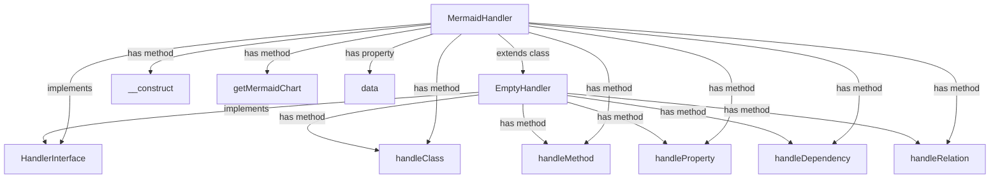

# phpgrapher

## What is PHPGrapher?

A tool to draw diagrams of php classes.

## How it works?

Given a PHP class, PHP Grapher can draw a diagram of it's components and dependencies. Let's say we want a diagram of a `MermaidHandler` class from this package:

````php
$handler = new MermaidHandler();
$traverser = new CodeTraverser($handler);
$traverser->traverseClass(MermaidHandler::class); 
echo $handler->getMermaidChart();
````
This will produce a diagram in mermaid format, which embeded in markdown looks like this:

