# phpgrapher
A tool to draw diagrams of php classes

Goal:

A code like:
````php
$traverser = new CodeTraverser(new PrintfHandler());
$traverser->traverseClass(SomeClass::class); 
````
Should produce output including all subclasses, interfaces, traits and superclasses plus all classes used in the constructor arguments.

```mermaid
flowchart LR
    Adam314\PhpGrapher\CodeTraverser\CodeTraverser-->|has method|__construct
    Adam314\PhpGrapher\CodeTraverser\CodeTraverser-->|has method|traverseClass
    Adam314\PhpGrapher\CodeTraverser\CodeTraverser-->|has property|traverseInterfaces
    Adam314\PhpGrapher\CodeTraverser\CodeTraverser-->|has property|traverseClasses
    Adam314\PhpGrapher\CodeTraverser\CodeTraverser-->|has property|traverseTraits
    Adam314\PhpGrapher\CodeTraverser\CodeTraverser-->|has property|traverseMethods
    Adam314\PhpGrapher\CodeTraverser\CodeTraverser-->|has property|traverseProperties
    Adam314\PhpGrapher\CodeTraverser\CodeTraverser-->|has property|traversingDepth
    Adam314\PhpGrapher\CodeTraverser\CodeTraverser-->|has property|handler
```


